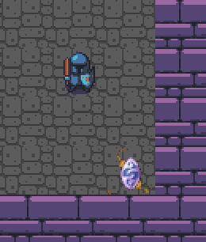
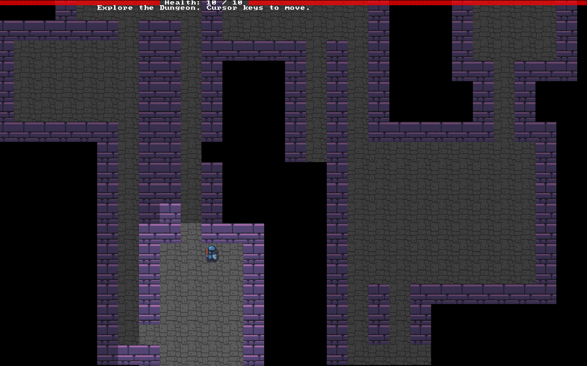

# Dungeon Crawler

### **Status:** _Work in Progress_

You can see the [Short Design Doc](design-doc.md) to get more info on the upcoming project.

Currently the game is build on top of [**legion**](https://github.com/amethyst/legion) ECS (Entity Component System)

### **Brief Description:**

#### **Aim:**

  
Find the amulet of YALA that was lost in the acient dungeion.

#### **Cotrols:**

- Move through the dungeon by pushing your arrow keys.
- Attack enemies by walking into them.
- Rest and heal by hitting any button other than keys.

